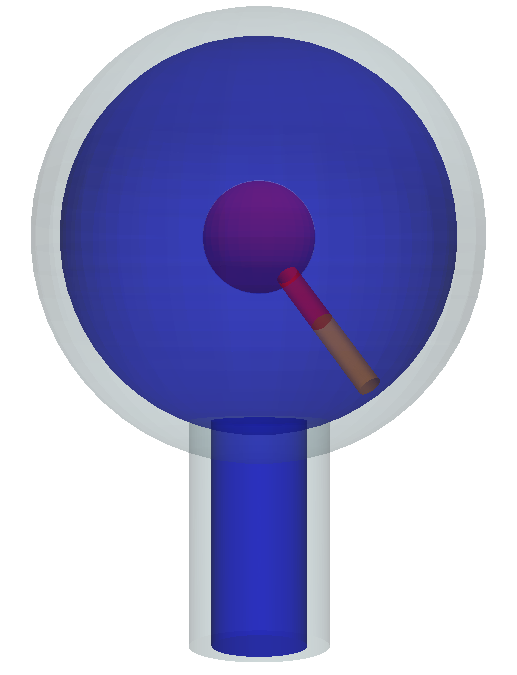

# Idealized Brain Meshing

This repository contains command-line tools for generating, tagging, and iteratively refining idealized multi-domain 3D brain meshes for Biot-Stokes-type simulations in FEniCSx.
The geometry corresponds to the one used in Chapter 4 of [*Mathematical Modelling of the Human Brain II: From Glymphatics to Deep Learning*](https://doi.org/10.1007/978-3-032-00679-0).


<p align="center"></p>
<p align="center">Idealized brain surfaces</p>


## Requirements
To install the required dependencies in a Conda environment, run
```bash
conda env create -f environment.yml
```
Then, activate the environment with
```bash
conda activate fenicsxmesh
```

## Tools
### 1. Mesh Generation (generateMesh.py)
Generates surface STLs using Pyvista and creates a volumetric FEniCSx mesh from these using CSG (Constructive Solid Geometry), also generating properly tagged subdomains and boundaries.

**Generate surface STLs:**

```bash
python generateMesh.py surfaces --output-dir surfaces
```
(Add `--show` to preview the geometry in a PyVista plot).

**Generate and tag the FEniCSx mesh:**

```bash
python generateMesh.py mesh --stl-dir surfaces --name meshname
```
This writes the mesh to `meshname/meshname.xdmf`.

(Add `--separate-interfaces` to tag the pial membrane and ventricular walls (ependyma) with distinct IDs instead of a unified interface tag).

Note: It is also possible to generate the mesh from the surface STLs with fTetWild directly from command line as
```bash
ftetwild --csg csg.json --output mesh/idealizedBrainMesh -e 0.002 -l 0.05
```

### 2. Uniform Mesh Refinement (refineMesh.py)
Iteratively refines an existing FEniCSx mesh while correctly transferring cell (subdomain) and facet (boundary) tags to the newly created child meshes.

**Refine a mesh:**

```bash
python refineMesh.py --input-dir mesh --levels 2
```
This will read the base mesh and sequentially generate `Ref1`, `Ref2`, etc., in sibling directories.

### Output Structure
After generating and refining the mesh, the directory structure will look similar to this:
```plaintext
.
├── meshes
│   ├── idealized
│   │   ├── config.yml
│   │   ├── idealized.h5
│   │   └── idealized.xdmf
│   ├── idealizedRef1
│   │   ├── config.yml
│   │   ├── idealizedRef1.h5
│   │   └── idealizedRef1.xdmf
│   :
:
```

### FEniCSx Marker Reference

When loading the `.xdmf` files into FEniCSx, use the following integer IDs:

#### Subdomains (Cells)

We generate two sets of subdomain markers. The `subdomains` tag separate the porous and fluid domains:
| ID | Type | Domain | Description |
| :--- | :--- | :--- | :--- |
| **`1`** | Subdomain | Porous | Parenchyma |
| **`2`** | Subdomain | Fluid | Subarachnoid space and ventricles 

The `subdomains_ftetwild` further separates the fluid space (for postprocessing purposes), as:
| ID | Type | Domain | Description |
| :--- | :--- | :--- | :--- |
| **`1`** | Subdomain | Fluid | Subarachnoid space 
| **`2`** | Subdomain | Porous | Parenchyma |
| **`3`** | Subdomain | Fluid | Lateral ventricles (empty for idealized)
| **`4`** | Subdomain | Fluid | Fourth ventricle
| **`5`** | Subdomain | Fluid | Third ventricles

#### Boundaries and interfaces (Facets)
The `boundaries` facet tags contain:
| ID | Type | Description | Notes |
| :--- | :--- | :--- | :--- |
| **`1`** | Boundary | Unified Tissue-CSF Interface | Default (if `--separate-interfaces` is not used) |
| **`2`** | Boundary | Skull | Outer boundary |
| **`3`** | Boundary | Spinal Canal | Bottom fluid boundary |
| **`4`** | Boundary | Spinal Cord | Bottom porous boundary |
| **`5`** | Boundary | Aqueduct | Internal interface for flow computation |
| **`11`** | Boundary | Pia Membrane | Used if `--separate-interfaces` is set |
| **`12`** | Boundary | Ependyma | Used if `--separate-interfaces` is set |

To read the mesh and mesh tags into FEniCSx, use

```python
with dolfinx.io.XDMFFile(MPI.COMM_WORLD, meshfile, "r") as xdmf:
    domain = xdmf.read_mesh()
    ct1 = xdmf.read_meshtags(current_domain, name="subdomains")
    ct2 = xdmf.read_meshtags(current_domain, name="subdomains_ftetwild")

    # Create connectivity before reading facet tags
    tdim = current_domain.topology.dim
    fdim = tdim - 1
    current_domain.topology.create_connectivity(fdim, tdim)

    ft = xdmf.read_meshtags(current_domain, name="boundaries")
```